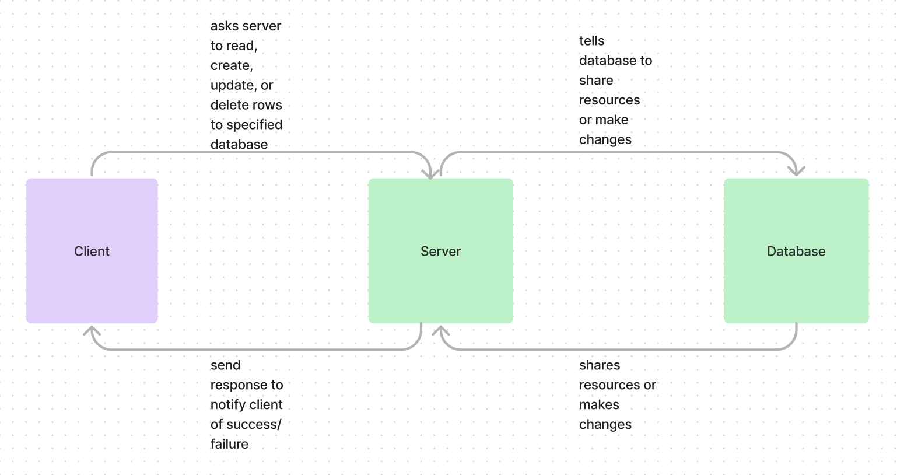

# Basic Express Server

The purpose is to create an express server to get more practive with express.Router, Jest, and relational databases.

## Cloud Deploy
https://prod-basicserverbackend.onrender.com

### Running the app
npm start

### Tests
Unit Tests: npm test

### Whiteboard

### Partner Code review for Lab 4

Julio Ramirez was my partner. I took away that the class seems to be going pretty smooth for a good number of people based off how we were able to easily sift through each others code!
My pull request to Julio: https://github.com/rzvdev1/api-server/pull/1
Julio pull request to me: https://github.com/rhettb253/basic-express-server/pull/9